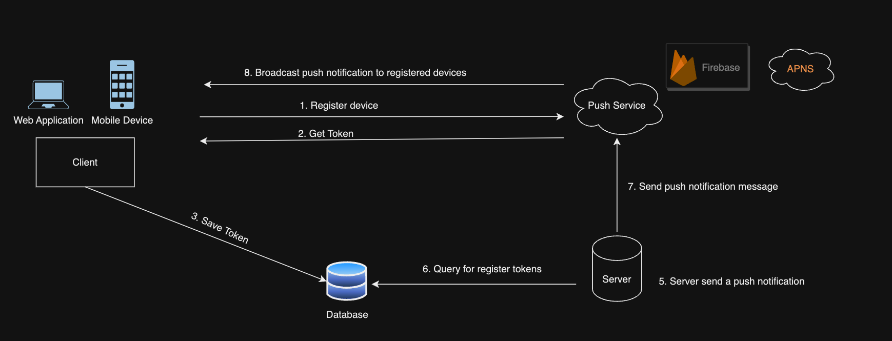

# Home Test - TIN TRUNG LUONG <lttinspk@gmail.com>

- [Home Test - TIN TRUNG LUONG lttinspk@gmail.com](#home-test---tin-trung-luong-lttinspkgmailcom)
  - [SDK/API design](#sdkapi-design)
  - [Backend Implementation](#backend-implementation)
    - [Registering Device/Client](#registering-deviceclient)
    - [Sending Notifications](#sending-notifications)
    - [Handling Callbacks and Event Listeners](#handling-callbacks-and-event-listeners)
    - [API Implementation](#api-implementation)
    - [Authentication](#authentication)
    - [Endpoint for Sending Notifications](#endpoint-for-sending-notifications)
    - [Endpoint for Handling Device Registration (Mobile Push Notification - Bonus)](#endpoint-for-handling-device-registration-mobile-push-notification---bonus)
    - [Endpoint for Notification Settings (Optional)](#endpoint-for-notification-settings-optional)
    - [Real-Time Notifications (Bonus)](#real-time-notifications-bonus)
  - [Push / Pull notification style](#push--pull-notification-style)
  - [Infrastructure (scalability and availability)](#infrastructure-scalability-and-availability)
  - [Bonus: Realtime](#bonus-realtime)



## SDK/API design

Implementing the API design for a web app involves setting up the necessary components and endpoints to handle notifications.

## Backend Implementation

### Registering Device/Client

- Include a function to register the user's device with the notification system. This is necessary for mobile push notifications.

### Sending Notifications

- Implement a function that allows developers to send notifications to specific users. The function should make a POST request to the API's notification endpoint with the relevant data.

### Handling Callbacks and Event Listeners

- Offer options for developers to register callback functions or event listeners to handle notification delivery status or other events.

### API Implementation

> On the server-side, you'll need to implement the API endpoints that the SDK will interact with. Here's a basic outline of the API implementation:

### Authentication

- Implement authentication middleware to validate access tokens or API keys provided during initialization.
- Ensure that only authenticated requests can trigger notifications.

### Endpoint for Sending Notifications

- Create an API endpoint that receives the necessary data to send a notification to a specific user.

  ```bash
   /api/v1/send_notification
  ```

- Validate the input data and handle the notification logic, such as deciding the delivery method (push or pull) and formatting the notification.

### Endpoint for Handling Device Registration (Mobile Push Notification - Bonus)

- Implementing mobile push notifications as a bonus feature, create an endpoint to handle device registration.

  ```bash
    /api/v1/register_device
  ```

- The client (web app) will call this endpoint to register the user's device with the notification system.

  ```bash
    /api/v1/register_user
  ```

### Endpoint for Notification Settings (Optional)

- To provide notification settings for users (e.g., mute notifications, customize notification preferences), create an endpoint to handle these preferences.

  ```bash
    /api/v1/notification_settings
  ```

### Real-Time Notifications (Bonus)

- Implementing real-time notifications, use a WebSocket implementation (e.g., Socket.io) to handle the real-time connection between the server and clients.
- Broadcast real-time events to clients through the WebSocket connection when relevant notifications are triggered.

## Push / Pull notification style

- The system should support both push and pull notification styles.
- For real-time events like messages or live updates, push notifications are sent directly to the user's device.
- For less time-sensitive notifications expect that users can retrieve them by pulling from the server when they log in or refresh the notification page.

## Infrastructure (scalability and availability)

- To ensure scalability and availability, the system should be designed using a microservices architecture. This allows each component to scale independently, depending on its load.

- The notification service should use distributed databases and caching mechanisms to handle high read and write loads efficiently. 

- Load balancers can be implemented to distribute incoming requests across multiple server instances.

- Redundancy and failover mechanisms should be in place to handle hardware failures and ensure continuous service availability.

## Bonus: Realtime

- To enable mobile push notifications, integrate with popular push notification providers like APNS and FCM or Amazon Simple Notification Service (Amazon SNS), Google Cloud Pub/Sub - Google Cloud Platform (GCP)

- The push notification service should be able to handle push notification delivery to millions of devices efficiently.

- For improved user experience, allow users to customize their mobile push notification preferences in the app settings.

- Message Queue (for scalability): can use a message queue like RabbitMQ or Apache Kafka in conjunction with the WebSocket server, or stack on cloud: Amazon SQS, Google Cloud Pub/Sub.